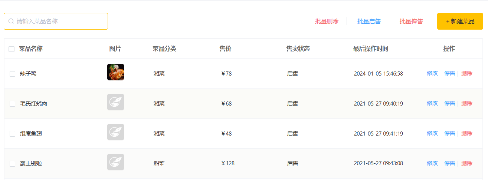
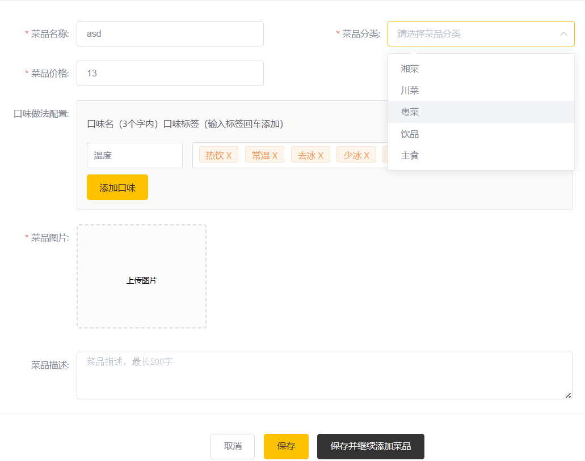

开始进行 Dish 菜品管理相关的开发. 该表包含一个图片字段, 需要上传图片以及图片回显的业务.
另外, 每个菜品可能包含多个口味选择, 例如 甜度, 辣度 等等. 因此需要单独一张表格存储: dish_flavor
表格的一行保存: dish_id, 对应的口味(其中一种)名称, 对应的口味(其中一种)可选列表 等等.

### 1. 表结构与菜品展示页面
```cmd
id
name
category_id
price
code
image
description
status
sort
create_time
update_time
create_user
update_user
is_deleted
```

```cmd
id
dish_id
name
value
create_time
update_time
create_user
update_user
is_deleted
```


### 2. 菜品的分类选择
在界面上, 需要展示菜品分类的下拉列表, 因此需要一个依据分类类型查询所有分类的业务函数, 它位于`CategoryController`
```java
@GetMapping("list")
public R<List<Category>> getAllCat(Integer type){
    log.info("查询键值: {}", type);
    LambdaQueryWrapper<Category> wrapper = new LambdaQueryWrapper<>();
    wrapper.eq(Category::getType, type);
    List<Category> res = service.list(wrapper);
    return R.success(res);
}
```

### 3. 图片的上传与下载
采用的是用户上传, 服务器下载保存的形式
上传图片, POST请求: `/common/upload/`, 使用 `MultipartFile` 类接收, 随后就是将文件流转存.
注意首先要生成一个新的文件名, 其次规定图片的临时存储地址, 随后进行转存:
```yml
my-config:
  basic-cache-dir: D:/cache/reggie/
```
通过 value 注解进行注入:
```java
@RestController
@RequestMapping("common")
@Slf4j
public class UpDownLoadController {
    @Value("${my-config.basic-cache-dir}")
    private String cacheRoot;

    @PostMapping("upload")
    public R<String> upload(MultipartFile file){
        log.info("接收到文件 {}, 大小 {}", file.getName(), file.getSize());
        File rootDir = new File(cacheRoot);
        if (!rootDir.exists())
            rootDir.mkdirs()
        String orgName = file.getOriginalFilename();
        String suffix = orgName.substring(orgName.lastIndexOf('.'));
        String newFileName = UUID.randomUUID() + suffix;
        try {
            file.transferTo(Paths.get(cacheRoot + newFileName));
        } catch (IOException e) {
            throw new BusinessException(e.getMessage());
        }
        return R.success(cacheRoot + newFileName);
    }
}
```

下载, 是指浏览器发送请求后服务器需要将指定的文件资源写入到响应中的过程.
注意这是一个 Get 请求, 同时这里采用每写入1024字节就刷新一次的方式而不是一次性写入, 注意传输完毕后关闭流:
```java
@GetMapping("download")
public R<String> download(String name, HttpServletResponse response){
    log.info("发送文件(用于客户端浏览器下载或展示): {}", name);
    try{
        FileInputStream inputStream = new FileInputStream(name);
        ServletOutputStream outputStream = response.getOutputStream();
        byte[] buffer = new byte[1024];
        int len;
        while (true){
            len = inputStream.read(buffer);
            if (len == -1)
                break;
            outputStream.write(buffer);
            outputStream.flush();
        }
        inputStream.close();
        outputStream.close();
        return R.success("下载成功");
    } catch (IOException e) {
        throw new BusinessException(e.getMessage());
    }
}
```

此时, 在新增菜品的页面就可以正常上传和展示图片了.

### 4. 新增菜品
新增菜品的页面要素基本齐全, 接下来就是接收传入参数, 并把数据插入到对应表格.
```java
@PostMapping
public R<String> insert(@RequestBody DishDto dishDto){
    log.info("接收到菜品信息: {}", dishDto);
    service.addWithFlavor(dishDto);
    return R.success("添加成功");
}
```
注意此时前端传入的数据并非恰好对应某一个实体类, 例如:
1. 菜品的口味, 这些数据要存到 dish_flavor 表
2. 菜品的分类, 传入的是分类名称, 但 Dish 实体类存储的是分类的 id.
为了接收这些数据, 需要创建一个 DTO 类(Data Transfer Object), 即 `DishDto`:
```java
package com.rain.reggie.dto;

@Data
public class DishDto extends Dish{
    private List<DishFlavor> flavors;
    private String categoryName;
    private Integer copies;
}
```
需要在 service 层编写 addWithFlavor 方法, 显然, 应当先执行插入操作保存 Dish 信息. 此时, 该条记录(Dish)在插入后会自动获得一个 id(a), 取出 flavors 字段, 遍历该列表, 设置其中的 dish_id 为a.

```java
 @Override
public void addWithFlavor(DishDto dishDto) {
    this.save(dishDto);
    Long dishId = dishDto.getId();
    List<DishFlavor> flavors = dishDto.getFlavors();
    flavors = flavors.stream().map(
            (item)->{
                item.setDishId(dishId);
                return item;
            }
    ).collect(Collectors.toList());
    flavorService.saveBatch(flavors);
}
```

### 5. 分页展示菜品
同样需要处理多表格查询的问题, 前端发来请求:
http://localhost:8080/dish/page?page=1&pageSize=10&name=aaa
这里是指, 假如仅仅是查询 Dish 表格, 得到的信息无法为前端页面提供足够的信息, 例如菜品的分类名称, 这需要查询分类表.
同时需要借助于 DishDto 类, 尽管此时已经不需要口味相关的信息.

基本步骤是:
1. 新建 Dish 的 Page 和 Wrapper, 调用 dishService 查询得到 dishPage.
2. 新建 DishDto 的 Page 对象 info, 将 dishPage 的属性值复制到 info 中, 忽略 records 的值.
3. 初始化一个空的 DishDto 列表 dl, 遍历 dishPage 的 records, 对于每一个 r:
   1. 取得 category_id, 调用 categoryService 获取到对应 Category 对象, 取得 categoryName.
   2. 新建 DishDto 对象 d, 将 r 的属性值复制给 d, 将 d 的 categoryName 字段设置为刚才查询到的值.
   3. 将 d 加入到 dl.
4. 将 info 的 records 属性设置为 dl.
5. 将 info 包装到 R 返回.

```java
@GetMapping("page")
public R<Page> page(int page, int pageSize, String name){
    LambdaQueryWrapper<Dish> wrapper = new LambdaQueryWrapper<>();
    Page<Dish> info = new Page<>(page, pageSize);
    wrapper.like(name!=null, Dish::getName, name);
    wrapper.orderByDesc(Dish::getUpdateTime);
    service.page(info);

    Page<DishDto> dtoPage = new Page<>();
    BeanUtils.copyProperties(info, dtoPage, "records");
    List<Dish> dishes = info.getRecords();
    List<DishDto> records = new ArrayList<>();
    for (Dish d: dishes){
        Long cat_id = d.getCategoryId();
        Category category = categoryService.getById(cat_id);
        DishDto rec = new DishDto();
        BeanUtils.copyProperties(d, rec);
        rec.setCategoryName(category.getName());
        records.add(rec);
    }
    dtoPage.setRecords(records);
    return R.success(dtoPage);
}
```

### 6. 修改菜品
在于两个点, 一是菜品信息回显, 需要一个依据菜品id查询到菜品基本信息以及菜品口味的信息.

二是具体修改, 需要修改菜品的基本信息以及口味信息, 由于菜品口味信息可删除或者可添加, 尽管也是修改了数据表, 但实际上并非针对某一条或者某一批数据条目中某些字段的修改, 可以认为是由删除操作和插入操作结合而来.

#### 6-1. 菜品信息回显
请求参数 dish_id 位于请求路径中:
```java
// DishController
@GetMapping("{dishId}")
public R<DishDto> getDishById(@PathVariable Long dishId){
    log.info("获取菜品信息(包括口味){}", dishId);
    DishDto dishDto = service.getDishWithFlavor(dishId);
    return R.success(dishDto);
}
```
在 `DishService` 中编写 `getDishWithFlavor` 方法:
```java
public DishDto getDishWithFlavor(Long dishId){
    Dish dish = this.getById(dishId);
    DishDto dishDto = new DishDto();
    BeanUtils.copyProperties(dish, dishDto);

    LambdaQueryWrapper<DishFlavor> wrapper = new LambdaQueryWrapper<>();
    wrapper.eq(DishFlavor::getDishId, dishId);
    List<DishFlavor> flavors = flavorService.list(wrapper);
    dishDto.setFlavors(flavors);
    
    return dishDto;
}
```

#### 6-1. 菜品信息更新
此时请求为 PUT 请求, 参数包装在 json 数据中:
```java
@PutMapping
public R<String> update(@RequestBody DishDto dishDto){
    log.info("更新菜品: {}", dishDto);
    service.updateWithFlavor(dishDto);
    return R.success("更新成功");
}
```
在 `DishService` 中编写 `updateWithFlavor` 方法:
```java
@PutMapping
public void updateWithFlavor(DishDto dishDto){
    this.updateById(dishDto);
    LambdaQueryWrapper<DishFlavor> wrapper = new LambdaQueryWrapper<>();
    wrapper.eq(DishFlavor::getDishId, dishId);
    flavorService.remove(wrapper);
    Long dishId = dishDto.getId();
    List<DishFlavor> flavors = dishDto.getFlavors();
    flavors = flavors.stream().map(
        (item)->{
            item.setDishId(dishId);
            return item;
        }
    ).collect(Collectors.toList());
    flavorService.saveBatch(flavors);
}
```
这里仍需对 flavors 的 dishId 进行设置, 这是由于部分口味可能是删除了的


