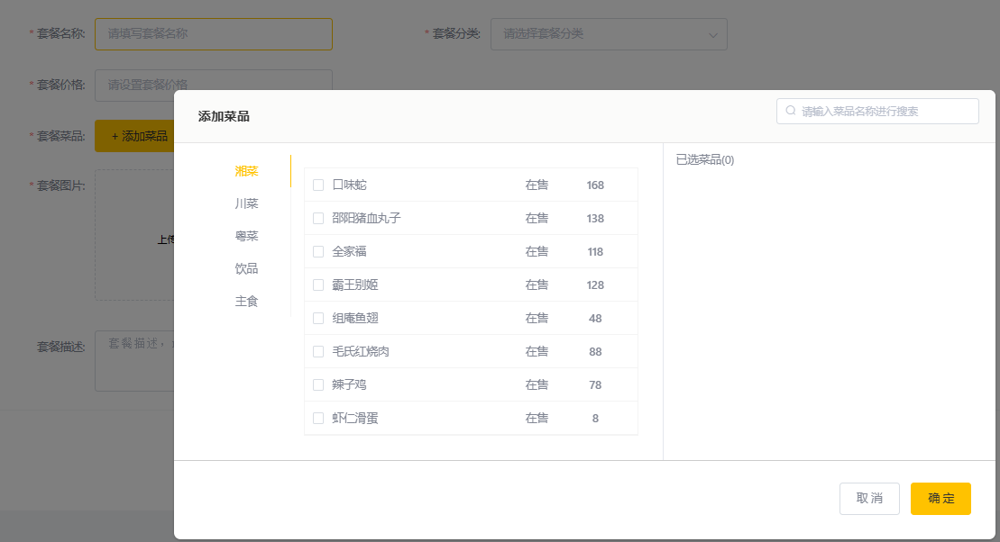

### 1. 需求分析与实体类准备

如上图为新增套餐的界面, 它包含了套餐的一些基本信息, 例如名称、价格等, 同时还有套餐分类(因此这里需要一个**查询所有套餐分类的请求处理方法, 需求A**). 以及弹出页面用于选择菜品, 包括**依据菜品分类或者名字进行查询的请求(需求B)**, 其他的还包括**图片的上传与展示(C)等等**, 这一新增操作涉及到两个表: setmeal 和 setmeal_dish 两个表, setmeal 表包含套餐的基本信息以及id, 而 setmeal_dish 则是一张关联表, 每一条记录包含某一套餐下的一类菜品, 实体类如下:
```java
@Data
public class Setmeal implements Serializable {
    private static final long serialVersionUID = 1L;

    private Long id;
    private Long categoryId;        //分类id
    private String name;            //套餐名称
    private BigDecimal price;       //套餐价格
    private Integer status;         //状态 0:停用 1:启用
    private String code;            //编码
    private String description;     //描述信息
    private String image;           //图片


    @TableField(fill = FieldFill.INSERT)
    private LocalDateTime createTime;
    @TableField(fill = FieldFill.INSERT_UPDATE)
    private LocalDateTime updateTime;
    @TableField(fill = FieldFill.INSERT)
    private Long createUser;
    @TableField(fill = FieldFill.INSERT_UPDATE)
    private Long updateUser;

    //是否删除
    private Integer isDeleted;
}
```
```java
@Data
public class SetmealDish implements Serializable {
    private static final long serialVersionUID = 1L;
    private Long id;
    private Long setmealId;     //套餐id
    private Long dishId;        //菜品id
    private String name;        //菜品名称(冗余字段)
    private BigDecimal price;   //菜品原价(冗余字段)
    private Integer copies;     //份数
    private Integer sort;       //排序

    @TableField(fill = FieldFill.INSERT)
    private LocalDateTime createTime;
    @TableField(fill = FieldFill.INSERT_UPDATE)
    private LocalDateTime updateTime;
    @TableField(fill = FieldFill.INSERT)
    private Long createUser;
    @TableField(fill = FieldFill.INSERT_UPDATE)
    private Long updateUser;

    //是否删除
    private Integer isDeleted;
}
```

同时为他们搭建 Mapper接口 和 Service层, 并建立 SetmealController:
```java
// mapper
package com.rain.reggie.mapper;
@Mapper
public interface SetmealMapper extends BaseMapper<Setmeal> {
}
@Mapper
public interface SetMealDishMapper extends BaseMapper<SetmealDish> {
}
// service
package com.rain.reggie.service;
public interface SetmealDishService extends IService<SetmealDish> {
}
public interface SetmealService extends IService<Setmeal> {
}
// service impl
package com.rain.reggie.service.impl;
@Service
public class SetmealDishServiceImpl extends ServiceImpl<SetMealDishMapper, SetmealDish> implements SetmealDishService {
}
// controller
package com.rain.reggie.controller;
@RestController
@RequestMapping("setmeal")
@Slf4j
public class SetmealController {
    @Autowired
    private SetmealService mealService;
}
```

显然由于传入的json数据并非以上任何一个实体类, 因而需要创建 DTO 类: 
```java
@Data
public class SetmealDto extends Setmeal {
    private List<SetmealDish> setmealDishes;
    private String categoryName;
}
```

### 2. 依据菜品分类或者名字进行查询的请求(需求B)
请求路径(示例):
http://localhost:8080/dish/list?categoryId=123
http://localhost:8080/dish/list?name=123
请求方式:
GET

为了兼容这两种查询方式, 使用 Dish 实体类接收, 使用时判断 categoryId 字段是否为空再进行查询:
```java
@GetMapping("list")
public R<List<Dish>> list(Dish dish){
    log.info("查询信息: {}", dish);
    Long categoryId = dish.getCategoryId();
    LambdaQueryWrapper<Dish> dishWrapper = new LambdaQueryWrapper<>();
    if (categoryId == null){
        String queryName = dish.getName();
        log.info("使用名称 {} 进行查询 ...", queryName);
        dishWrapper.like(queryName!=null, Dish::getName, queryName);
    }else {
        log.info("使用分类 {} 进行查询 ...", categoryId);
        dishWrapper.eq(Dish::getCategoryId, categoryId);
    }
    dishWrapper.orderByAsc(Dish::getSort).orderByDesc(Dish::getUpdateTime);
    List<Dish> dishes = service.list(dishWrapper);
    return R.success(dishes);
}
```

### 3. 新增套餐
请求路径:
http://localhost:8080/setmeal
请求方式:
POST
如下为从浏览器 copy 的请求数据示例:
```json
{
    "name": "儿童套餐经典版",
    "categoryId": "1413386191767674881",
    "price": 18000,
    "code": "",
    "image": "D:/cache/reggie/dfb496e6-d4a8-4c45-bf79-a02e7ca08ffa.jpg",
    "description": "我连一亿都不敢想，她直接600亿[泪][泪][泪]​",
    "dishList": [],
    "status": 1,
    "idType": "1413386191767674881",
    "setmealDishes": [
        {
            "copies": 1,
            "dishId": "1397851668262465537",
            "name": "口味蛇",
            "price": 16800
        },
        {
            "copies": 1,
            "dishId": "1397854865672679425",
            "name": "鱼香炒鸡蛋",
            "price": 2000
        },
        {
            "copies": 2,
            "dishId": "1413384757047271425",
            "name": "王老吉",
            "price": 500
        },
        {
            "copies": 1,
            "dishId": "1413385247889891330",
            "name": "米饭",
            "price": 200
        }
    ]
}
```
注意, 不要更改 Setmeal 实体类的名称以及其中字段的名称, 因为这是要与 mysql 中表以及表中字段一一对应的.
例如 Setmeal 实体对应 setmeal 表. 而如果这样写: SetMeal, 那么它对应 set_meal 表(实际上数据库只有 setmeal 表, 因此万不可错写)
SetmealController 中新增方法:
```java
@PostMapping
public R<String> insert(@RequestBody SetmealDto setMealDto){
    log.info("待添加的套餐: {}", setMealDto);
    mealService.addWithDish(setMealDto);
    return R.success("套餐添加成功");
}
```
SetmealServiceImpl 中重写方法:
```java
@Transactional
@Override
public void addWithDish(SetmealDto setMealDto) {
    // 1. 将数据插入到 set meal 表, 注意 code 字段未填充
    this.save(setMealDto);
    // 2. 将 set meal Dishes 数据依次插入到 SetMealDish 表, 注意字段填充
    List<SetmealDish> setmealDishes = setMealDto.getSetmealDishes();
    setmealDishes = setmealDishes.stream().map((item)->{
        item.setSetmealId(setMealDto.getId());
        return item;
    }).collect(Collectors.toList());
    setMealDishService.saveBatch(setmealDishes);
}
```


