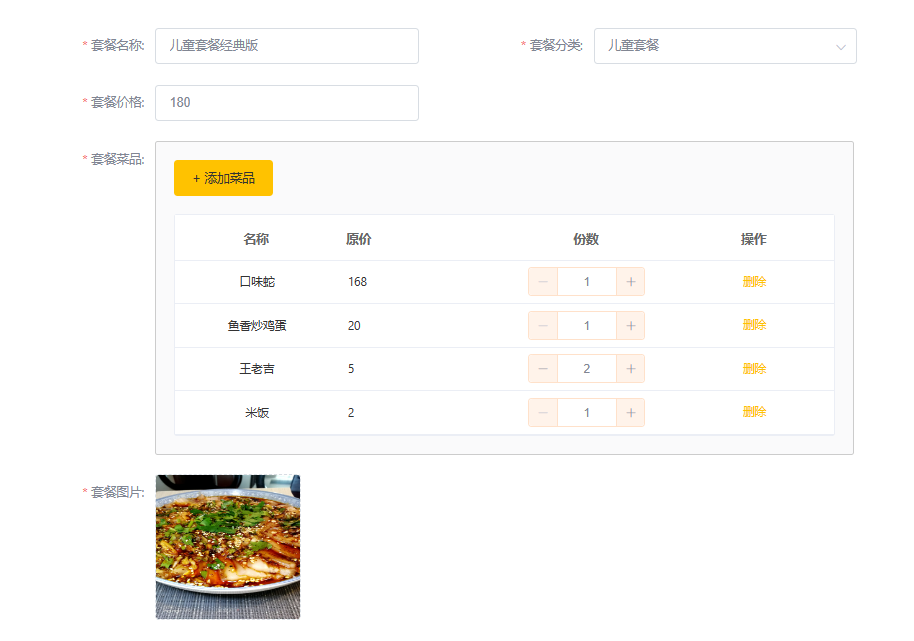

这部分开发剩下的部分功能, 包括分页查询、更新套餐、批量停售/启售, 继续熟悉业务代码编写.

### 1. 套餐的分页查询
请求路径与请求参数(示例):
http://localhost:8080/setmeal/page?page=1&pageSize=10
同样为了得到 分类名称, 这里需要查询多个表(一般每个表都会建立对应的 mapper 和 service):
```java
@GetMapping("page")
public R<Page> page(int page, int pageSize, String name){
    log.info("page={}, pageSize={}, name={}", page, pageSize, name);
    Page<Setmeal> setmealPage = new Page<>(page, pageSize);
    LambdaQueryWrapper<Setmeal> setmealWrapper = new LambdaQueryWrapper<>();
    setmealWrapper.like(name!=null, Setmeal::getName, name);
    setmealWrapper.orderByDesc(Setmeal::getUpdateTime);
    mealService.page(setmealPage, setmealWrapper);

    Page<SetmealDto> dtoPage = new Page<>();
    BeanUtils.copyProperties(setmealPage, dtoPage, "records");
    List<Setmeal> setmealList = setmealPage.getRecords();
    dtoPage.setRecords(setmealList.stream().map((item)->{
        SetmealDto setmealDto = new SetmealDto();
        BeanUtils.copyProperties(item, setmealDto);
        Category category = categoryService.getById(setmealDto.getCategoryId());
        setmealDto.setCategoryName(category.getName());
        return setmealDto;
    }).collect(Collectors.toList()));

    return R.success(dtoPage);
}
```

### 2. 更新套餐

如上图所示为更新的页面(完成后)
#### 第一步, 依据套餐id查询到套餐的基本信息以及关联菜品信息.
请求路径(示例):
http://localhost:8080/setmeal/1744602992542199810
请求方式:
GET
这里依旧需要查询两个表:
```java
// SetmealController
@GetMapping("/{setMealId}")
public R<SetmealDto> getById(@PathVariable Long setMealId){
    log.info("依据套餐ID查询基本信息以及套餐包含的菜品: {}", setMealId);
    SetmealDto dto = mealService.getSetmealWithDish(setMealId);
    return R.success(dto);
}
// SetmealServiceImpl
@Override
public SetmealDto getSetmealWithDish(Long setMealId) {
    Setmeal meal = this.getById(setMealId);
    SetmealDto dto = new SetmealDto();
    BeanUtils.copyProperties(meal, dto);

    LambdaQueryWrapper<SetmealDish> dishWrapper = new LambdaQueryWrapper<>();
    dishWrapper.eq(SetmealDish::getSetmealId, setMealId);
    dishWrapper.orderByAsc(SetmealDish::getSort).orderByDesc(SetmealDish::getUpdateTime);
    List<SetmealDish> setmealDishList = setMealDishService.list(dishWrapper);

    dto.setSetmealDishes(setmealDishList);

    return dto;
}
```
#### 第2步, 将请求数据进行保存(更新).
同样更新操作存在于两个表, 所以需要事务特性
请求路径:
http://localhost:8080/setmeal
请求方式:
PUT

SetmealController
```java
@PutMapping
public R<String> update(@RequestBody SetmealDto dto){
    log.info("修改套餐信息: {}", dto);
    mealService.updateWithMealDishes(dto);
    return R.success("修改成功");
}
```
SetmealDishServicelmpl
```java
@Transactional
@Override
public void updateWithMealDishes(SetmealDto dto) {
    this.updateById(dto);   // 修改基本信息
    // 修改套餐-菜品关联信息: 先删再加
    List<SetmealDish> dishList = dto.getSetmealDishes();
    LambdaQueryWrapper<SetmealDish> wrapper = new LambdaQueryWrapper<>();
    wrapper.eq(SetmealDish::getSetmealId, dto.getId());
    setMealDishService.remove(wrapper);
    dishList = dishList.stream().map((item)->{
        item.setSetmealId(dto.getId());
        return item;
    }).collect(Collectors.toList());
    setMealDishService.saveBatch(dishList);
}
```

### 3. 批量的停售启售
请求路径及参数示例如下:
停售
http://localhost:8080/dish/status/0?ids=1397851668262465537
启售
http://localhost:8080/setmeal/status/1?ids=1744602992542199810

于是, 无论是对批量的或者单个的套餐进行启售或者停售操作, 它们都可以集中到一个请求处理方法中:
```java
@PostMapping("/status/{st}")
public R<String> updateStatusBatch(@PathVariable Integer st, String ids){
    List<Long> setmealIdList = Arrays.stream(ids.split(",")).map(Long::parseLong).toList();
    mealService.updateStatusBatch(st, setmealIdList);
    return R.success("状态修改成功");
}
```
其中一个比较复杂的情况是这里有一个路径参数 st = 0/1 以及套餐的 id 列表, 接收时一是使用 String 类型接收, 二是名字不要弄错, 要和请求参数名一致: ids. 这里先把字符串分割成列表再转为 Long 的整数类型.
```java
@Transactional
@Override
public void updateStatusBatch(Integer st, List<Long> setmealIdList) {
    // 批量停售/启售套餐
    LambdaQueryWrapper<SetmealDish> setmealDishWrapper = new LambdaQueryWrapper<>();
    // 注意启售套餐时, 套餐内不可有停售的菜品
    List<Setmeal> setmealList = setmealIdList.stream().map((item) -> {
        Setmeal setmeal = this.getById(item);
        setmeal.setStatus(st);
        if (st == 1) {
            setmealDishWrapper.eq(SetmealDish::getSetmealId, setmeal.getId());
            List<SetmealDish> dishList = setMealDishService.list(setmealDishWrapper);
            for (SetmealDish setmealDish : dishList) {
                Dish dish = dishService.getById(setmealDish.getDishId());
                if (dish.getStatus() == 0)
                    throw new BusinessException("套餐内" + dish.getName() + "处于停售状态, 套餐无法启售");
            }
        }
        return setmeal;
    }).toList();
    this.updateBatchById(setmealList);
}
``` 
如若不考虑 **启售套餐时, 套餐内不可有停售的菜品** 的条件, 则实际上只需要更改 setmeal 表即可. 然而, 在考虑该条件后, 涉及到更多的表, 过程是先依据 setmeal 的 id 查询 setmeal_dish 表得到 SetmealDish 的列表, 遍历该列表, 依据其中的 dishId 查询 dish 表, 得到 Dish 对象, 查看该对象的 status 是否为 0 (停售), 若为0, 则抛出业务异常, 信息中提示菜品名称.


