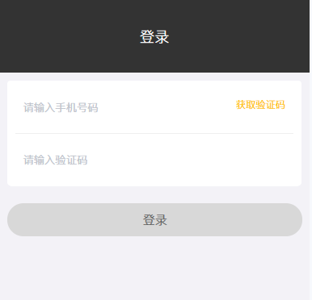
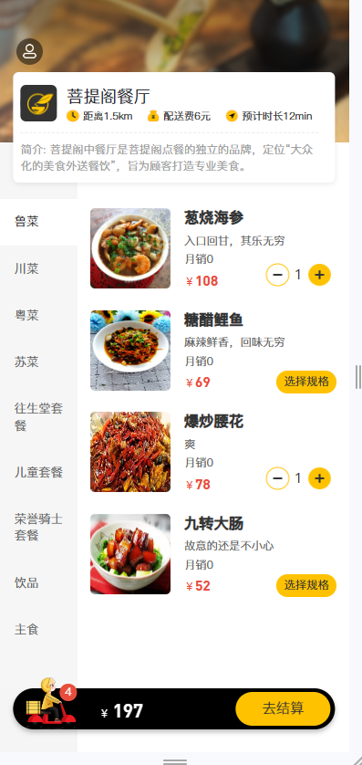
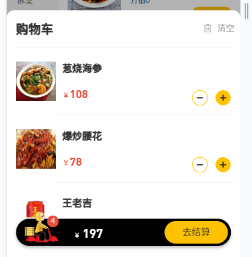
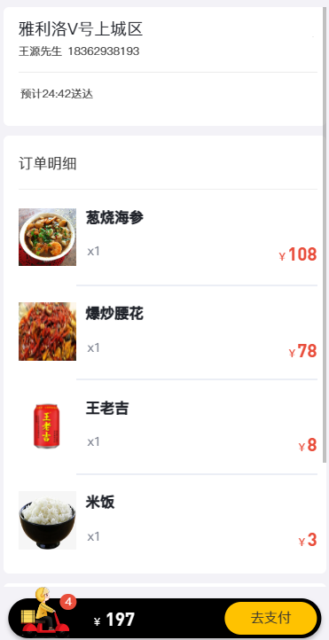
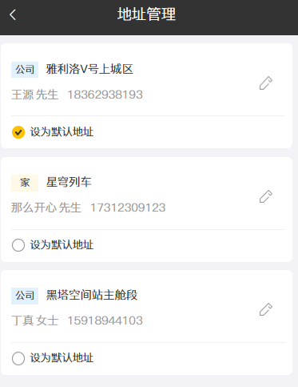

### 1. 基本需求分析
用户登录, 此处未实现发送短信的接口, 如有实际需求, 可以使用阿里云服务(需申请和备案):

用户登录成功后跳转到系统首页，在首页需要根据分类来展示菜品和套餐。如果菜品设置了口味信息，需要展示选择规格 按钮，否则显示+ 按钮。

用户可以点击菜品下方的加号将菜品添加到购物车:

点击去结算则来到订单生成页面:

注意这里有一个默认配送地址, 这里的地址信息需要用户自己设置:

点击去支付则生成订单, 未模拟实际的支付操作.


### 2. 用户登录
登陆页面地址: 
http://localhost:8080/front/page/login.html
请求地址:
http://localhost:8080/user/login
请求方式:
POST

首先, 建立用户实体 User 和对应的 mapper+service 接口和实现类:
```java
@Data
public class User implements Serializable {
    private static final long serialVersionUID = 1L;
    private Long id;
    private String name;        //姓名
    private String phone;       //手机号
    private String sex;         //性别 0 女 1 男
    private String idNumber;    //身份证号
    private String avatar;      //头像
    private Integer status;     //状态 0:禁用，1:正常
}
```

接着, 新建 UserContoller 并编写登录请求处理逻辑, 由于未实现验证码的发送逻辑, 这里只需要检索手机号是否存在于数据库即可, 对于不存在的, 则自动注册, 注意 getId() 的获取位置:
```java
@RestController
@RequestMapping("user")
@Slf4j
public class UserController {
    @Autowired
    UserService userService;

    @PostMapping("login")
    public R<User> login(HttpServletRequest request, @RequestBody User user){
        log.info("登录用户: {}", user);
        String phone = user.getPhone();
        LambdaQueryWrapper<User> userWrapper = new LambdaQueryWrapper<>();
        userWrapper.eq(User::getPhone, phone);
        User query = userService.getOne(userWrapper);
        if (query == null){
            log.info("新用户, 自动进行注册.");
            userService.save(user);
            request.getSession().setAttribute("user", user.getId());
        }else
            request.getSession().setAttribute("user", query.getId());
        return R.success(user);
    }
}
```

需要修改过滤器的处理规则, 一是将用户端的登录请求加入免试列表, 二是加入检测用户登入的代码, 复制一份员工登入的代码即可:
```java
String[] ok_list = {
    "/employee/login",
    "/employee/logout",
    "/user/login",
    "/backend/**",
    "/front/**"
};
if (null != request.getSession().getAttribute("user")){
    log.info("用户已登录");
    Long user_id = (Long) request.getSession().getAttribute("user");
    BaseContext.setId(user_id);
    filterChain.doFilter(request, response);
    return;
}
```
使用如下几个手机号进行测试:
18362938193
19201239140
18271044153
编写登出逻辑:
```java
@PostMapping("loginout")
public R<String> logout(HttpServletRequest request){
    log.info("用户{}退出登录", request.getSession().getAttribute("user"));
    request.getSession().removeAttribute("user");
    return R.success("退出成功");
}
```

### 3. 首页套餐菜品与购物车的展示

#### 3-1. 菜品展示
主体类似于新建套餐选择菜品时的按分类查询菜品的功能.
请求地址: 
http://localhost:8080/category/list 
请求方式: 
GET 
 
这里由于前端将该请求与购物车的查询请求: 
http://localhost:8080/shoppingCart/list
绑定在了一起, 因此此时首页将什么都不会展示.

为此, 先编写购物车实体类:
```java
@Data
public class ShoppingCart implements Serializable {
    private static final long serialVersionUID = 1L;
    private Long id;

    private String name;        //名称
    private Long userId;        //用户id
    private Long dishId;        //菜品id
    private Long setmealId;     //套餐id
    private String dishFlavor;  //口味
    private Integer number;     //数量
    private BigDecimal amount;  //金额
    private String image;       //图片
    private LocalDateTime createTime;
}

```
同时搭建好 mapper 和 service 层, 在 controller 层新建 ShoppingCartController 类, 同时加入处理 `list` 请求的方法: 
```java
public class ShoppingCartController {
    @Autowired
    private ShoppingCartService cartService;

    @GetMapping("list")
    public R<List<ShoppingCart>> list(){
        return null;
    }
```
方法实际处理逻辑待定, 但此时重启应用可以看到分类条目下已经有显示了. 然而, 实际上原先的 list 方法(DishContoller.list)还需要修改, 它返回的值应当还包含口味数据, 返回值类型设定为 `List<DishDto>`, 为此, 修改方法如下:
```java
// http://localhost:8080/dish/list?categoryId=174509696310623846
@GetMapping("list")
public R<List<DishDto>> list(Dish dish){
    log.info("查询信息: {}", dish);
    Long categoryId = dish.getCategoryId();
    LambdaQueryWrapper<Dish> dishWrapper = new LambdaQueryWrapper<>();
    if (categoryId == null){
        String queryName = dish.getName();
        log.info("使用名称 {} 进行查询 ...", queryName);
        dishWrapper.like(queryName!=null, Dish::getName, queryName);
    }else {
        log.info("使用分类 {} 进行查询 ...", categoryId);
        dishWrapper.eq(Dish::getCategoryId, categoryId);
    }
    dishWrapper.eq(Dish::getStatus, 1);
    dishWrapper.orderByAsc(Dish::getSort).orderByDesc(Dish::getUpdateTime);
    List<Dish> dishes = service.list(dishWrapper);

    // 将口味数据也封装进去
    List<DishDto> dishDtoList = new ArrayList<>();
    for (Dish item: dishes){
        DishDto dishDto = new DishDto();
        BeanUtils.copyProperties(item, dishDto);
        LambdaQueryWrapper<DishFlavor> dishFlavorWrapper = new LambdaQueryWrapper<>();
        dishFlavorWrapper.eq(DishFlavor::getDishId, item.getId());
        dishDto.setFlavors(flavorService.list(dishFlavorWrapper));
        dishDtoList.add(dishDto);
        log.info("----{}-----", dishDto);
    }
    return R.success(dishDtoList);
}
```
唯一需要注意的一点是 wrapper 需要在循环体内部定义, 否则 eq 条件会不断叠加. 另外如果有部分菜品设置了口味但未出现 "选择规格" 的字样, 可能是菜品列表中的旧数据id字段等无法对应, 可以一并删除清空, 再利用前端页面添加自定义的数据, 此时这些数据将符合一致性。另外, CategoryController.list 方法也需要稍加修改:
```java
// http://localhost:8080/category/list
@GetMapping("list")
public R<List<Category>> getAllCat(Integer type){
    log.info("查询键值: {}", type);
    LambdaQueryWrapper<Category> wrapper = new LambdaQueryWrapper<>();
    wrapper.eq(type!=null, Category::getType, type);
    wrapper.orderByAsc(Category::getSort).orderByDesc(Category::getUpdateTime);
    List<Category> res = service.list(wrapper);
    return R.success(res);
}
```
这样在 type 为空时就能查到所有的分类, 以及对结果进行了排序.

#### 3-2. 套餐展示
若点击的是套餐分类, 则页面显示分类下的套餐
http://localhost:8080/setmeal/list?categoryId=1745097281428746242&status=1
```java
@GetMapping("list")
public R<List<Setmeal>> list(Setmeal setmeal){
    log.info("依据套餐分类查询套餐: categoryId={}", setmeal.getCategoryId());
    LambdaQueryWrapper<Setmeal> wrapper = new LambdaQueryWrapper<>();
    wrapper.eq(Setmeal::getCategoryId, setmeal.getCategoryId());
    wrapper.eq(Setmeal::getStatus, setmeal.getStatus());
    return R.success(mealService.list(wrapper));
}
```

#### 3-3. 购物车管理
用户点单后, 相应的套餐或菜品会放到购物车里, 主要的方法是添加和展示.
##### 3-3-1. 展示购物车
先完善 list 方法, 它查询购物车列表, 返回当前登录用户点的所有菜品及套餐:
http://localhost:8080/shoppingCart/list
```java
@GetMapping("list")
public R<List<ShoppingCart>> list(HttpServletRequest request){
    Long userId = (Long) request.getSession().getAttribute("user");
    log.info("查询当前用户的购物车信息: {}", userId);
    LambdaQueryWrapper<ShoppingCart> wrapper = new LambdaQueryWrapper<>();
    wrapper.eq(ShoppingCart::getUserId, userId);
    return R.success(cartService.list(wrapper));
}
```
##### 3-3-2. 添加购物车
接着完善添加方法, 注意添加时若已存在该套餐或菜品则将份数加一.
请求 URL:
http://localhost:8080/shoppingCart/add
请求方法:
POST
```json
{
    "amount": 138,
    "dishId": "1397851370462687234",
    "name": "邵阳猪血丸子",
    "image": "D:/cache/reggie/981c66f1-e7ab-48af-8f06-320fbf70ab2c.jpeg"
}
```
```java
@PostMapping("add")
public R<ShoppingCart> add(HttpServletRequest request, @RequestBody ShoppingCart shoppingCart){
    log.info("添加菜品/套餐到购物车: {}", shoppingCart);
    Long userId = (Long) request.getSession().getAttribute("user");
    Long setmealId = shoppingCart.getSetmealId();
    Long dishId = shoppingCart.getDishId();
    shoppingCart.setUserId(userId);
    // 注意需要查询当前菜品是否已经在购物车
    LambdaQueryWrapper<ShoppingCart> shopWrapper = new LambdaQueryWrapper<>();
    shopWrapper.eq(ShoppingCart::getUserId, userId);
    shopWrapper.eq(setmealId!=null, ShoppingCart::getSetmealId, setmealId);
    shopWrapper.eq(dishId!=null, ShoppingCart::getDishId, dishId);
    ShoppingCart cart = cartService.getOne(shopWrapper);
    if (cart == null){
        shoppingCart.setNumber(1);
        cartService.save(shoppingCart);
        return R.success(shoppingCart);
    }else {
        cart.setNumber(cart.getNumber()+1);
        cartService.updateById(cart);
        return R.success(cart);
    }
}
```
