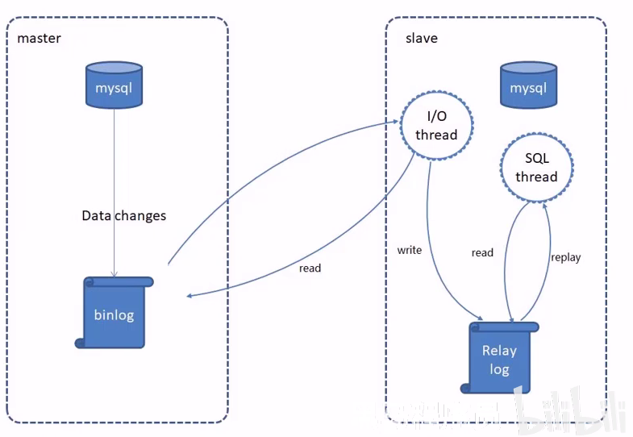

**读写分离** 是指将数据库的读操作和写操作分离到不同的数据库服务器上，以提高数据库的性能和可用性。在高并发的场景下，读操作通常占据了大部分的数据库负载，而写操作则相对较少。通过将读操作分发到多个服务器上，可以有效减轻单个数据库服务器的负载压力，提高数据库的并发处理能力。

### 读写分离的作用
读写分离的主要作用是提高数据库的性能和可用性。通过将读操作分发到多个服务器上，可以提高数据库的并发处理能力，减轻单个数据库服务器的负载压力。同时，通过将读操作分发到多个服务器上，可以提高数据库的可用性，当某个服务器发生故障时，其他服务器可以继续提供读服务。

### 主从复制（Master-Slave Replication）
主从复制是最常见的MySQL读写分离方案之一。在主从复制方案中，一个数据库服务器充当主服务器，负责处理写操作，而其他数据库服务器充当从服务器，负责处理读操作。主服务器将写操作的更新记录同步到从服务器，从服务器可以通过复制机制实时获取主服务器的更新。
#### 如何实现主从复制
实现主从复制需要进行以下步骤：
配置主服务器和从服务器的MySQL实例。
在主服务器上启用 **二进制日志(binary log)** 功能。
在从服务器上启用复制功能，并指定主服务器的地址和认证信息。
等待从服务器完成数据同步。

总的来说:
MySQL主从复制是一个异步的复制过程, 底层基于 Mysql 数据库自带的二进制日志功能, 是一台或多台 Mysql 数据库(slave, 即从库)从另一台 Mysql 数据库(master, 即主库)进行日志的复制然后再解析日志并应用到自身, 最终实现从库的数据和主库的数据保持一致的过程。 Mysql 主从复制是MVSOL数据库自带功能, 无需借助第三方工具.

MySOL复制过程分成三步:
● master 将改变记录到二进制日志(binary log)
● slave 将 master 的 binary log 拷贝到它的中继日志(relay log)
● slave 重做中继日志中的事件，将改变应用到自己的数据库中


### MySQL 配置
提前准备好两台服务器，分别安装 Mysql 并启动服务成功
主库(Master):  192.168.138.100
从库(slave): 192.168.138.101
#### 主库配置
第一步: 修改 Mysql 数据库的配置文件 `/etc/my.cnf`
```yml
log-bin=mysql-bin   # [必须] 启用二进制日志
server-id=100       # [必须] 服务器唯一ID
```
第二步: 重启 Mysql 服务
`systemctl restart mysqld`
第三步: 登录 Mysql 数据库，执行下面SQL
```sql
GRANT REPLICATION SLAVE ON *.* to 'xiaoming'@'%' identified by '123456';
```
创建一个用户 `xiaoming`, 密码为 `123456`, 并且给 `xiaoming` 用户授予 `REPLICATION SLAVE` 权限, 该权限常用于建立复制: 也就是slave必须被master授权具有该权限的用户, 才能通过该用户复制.

第四步: 执行下面SQL, 记录下结果中 `File` 和 `Position` 的值
`show master status;`
注: 上面SQL的作用是查看Master的状态，执行完此SQL后不要再执行任何操作

#### 从库配置
第一步: 修改Mysql数据库的配置文件`/etc/my.cnf`
```yml
server-id=101 #[必须]服务器唯-ID
```
第二步:重启 Mysql 服务
`systemctl restart mysqld`
第三步:登录Mysql数据库，执行下面SQL
```sql
change master to
master_host='223.104.123.88', 
master_user='syn_user', 
master_password='syn226', 
master_log_file='MRRAINBOW-bin.000089', 
master_log_pos=1103;
start slave;
```

注意:
1. 关于文件位置, 可以使用:
`mysql --help`
命令进行查看
例如 windows 下:
```
Default options are read from the following files in the given order:
C:\WINDOWS\my.ini 
C:\WINDOWS\my.cnf 
C:\my.ini 
C:\my.cnf 
C:\Program Files\MySQL\MySQL Server 8.0\my.ini 
C:\Program Files\MySQL\MySQL Server 8.0\my.cnf
```

2. 关于授权管理:
语法格式为:
`GRANT privileges ON database.table TO 'username'@'host';`
例如:
`grant REPLICATION SLAVE on *.* to 'syn_user'@'%';`
`grant select, insert, update, delete on testdb.* to common_user@'%'`
另外, 在 nysql8.0 中, 用户创建和用户授权需要分两条语句执行:
```sql
-- 创建账户
CREATE USER '用户名'@'访问主机' IDENTIFIED BY '密码';

-- 为创建的账户赋权
GRANT '权限列表' ON '数据库' TO '用户名'@'访问主机';
GRANT ALL ON *.* TO 'root'@'%';

-- 刷新
FLUSH PRIVILEGES;
```

3. 关于 mysqld 服务启动失败
建议首先查看 mysql 启动日志, 而不是去网上查找, 因为启动失败的原因会有很多, 最好是看报错日志.
linux 下, 错误日志位于 `/var/log/mysql/` 目录下.

4. 关于连接失败
首先检查防火墙状态, 3306 端口是否开放;
其次检查机器上 mysqld 服务运行状态, 是否正常运行;
接着登入 mysql, 查询 mysql 下的 user 表, 查看各个用户允许的 host 状态, 若为 localhost 则说明该用户仅允许本机访问.

...


### SpringBoot support
SpringBoot 中有许多插件, 支持自动化的 mysql 主从配置服务.

...


