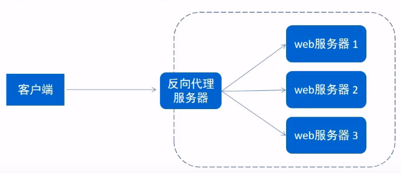
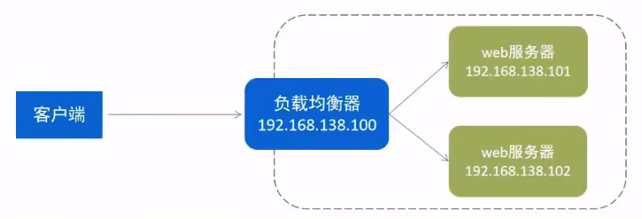
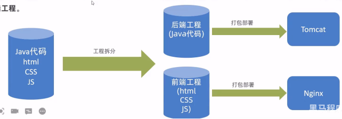
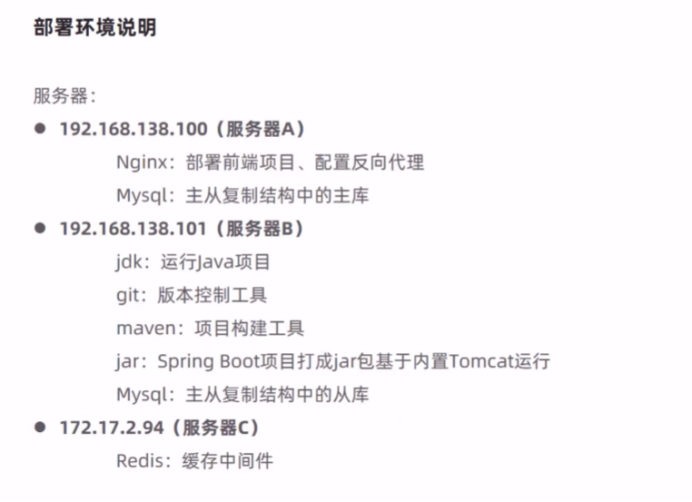

## Nginx概述
### Nginx介绍
Nginx是一款轻量级的web 服务器/反向代理服务器及电子邮件(IMAP/POP3)代理服务器。其特点是占有内存少，并发能力强，事实上nginx的并发能力在同类型的网页服务器中表现较好，中国大陆使用nginx的网站有:百度、京东.新浪、网易、腾讯、淘宝等。

官网: https://nginx.org

### Nginx下载和安装
安装过程:
1. 安装依赖包 yum -y install gcc pcre-devel zlib-devel openssl openssl-devel
2. 下载Nginx安装包 wget https://nginx.org/download/nginx-1.16.1.tar.gz
3. 解压 tar -zxvf nginx-1.16.1.tar.gz
4. cd nginx-1.16.1
5. ./configure --prefix=/usr/local/nginx
6. make && make install

### Nginx的目录结构
安装完Nginx后, 先来熟悉一下 Nginx的目录结构(tree 命令, 没有可以自己安装):

重点目录/文件| 描述·
:-|:-
conf/nginx.conf | nginx配置文件
html | 存放静态文件(htm1, css, js等)
1og | 日志目录, 存放日志文件
sbin/nginx | 二进制文件, 用于启动、停止Nginx服务

查看Nginx版本可以使用命令: `./nginx -v`
在启动Nginx服务之前，可以先检查一下`conf/nginx.conf`文件配置的是否有错误, 命令如下: `./nginx -t`

### 启动和停止
启动Nginx服务使用如下命令: `./nginx`
停止Nginx服务使用如下命令: `./nginx -s stop`
启动完成后可以查看Nginx进程: `ps -ef|grep nginx`
`firewall-cmd --zone=public --add-port=80/tcp --permanent`
当修改Nginx配置文件后，需要重新加载才能生效，可以使用下面命令重新加载配置文件: `/nginx -s reload`

为了使 nginx 命令使用更方便, 可以编辑环境变量:
```sh
vim /etc/profile
# path中追加 nginx 路径
source /etc/profile
```

## nginx.conf
```conf
#user  nobody;
worker_processes  1;
#error_log  logs/error.log;
#error_log  logs/error.log  notice;
#error_log  logs/error.log  info;
#pid        logs/nginx.pid;

events {
    worker_connections  1024;
}

http {
    include       mime.types;
    default_type  application/octet-stream;
    sendfile        on;
    keepalive_timeout  65;

    server {
        listen       80;
        server_name  localhost;
        location / {
            root   html;
            index  index.html index.htm;
        }
        
        error_page   500 502 503 504  /50x.html;
        location = /50x.html {
            root   html;
        }
    }
}
```
如上所示为 nginx.conf 的一个示例, 可见该配置文件是分层级的, 第一层为:
* 全局块: 代理、缓存、日志记录、虚拟主机配置
* Events块
* Http块

其中主要需要配置的是 http块, 它包含一些 http 全局配置和一些 server 块, 每个 server 又包含一些 server 全局配置和一些 location块.
注意: http块中可以配置多个Server块，每个Server块中可以配置多个location块。

### Nginx 应用
#### 部署静态资源
**Nginx可以作为静态web服务器来部署静态资源。** 静态资源指在服务端真实存在并且能够直接展示的一些文件，比如常见的html页面、css文件、js文件、图片、视频等资源。相对于Tomcat, Nginx处理静态资源的能力更加高效，所以在生产环境下，一般都会将静态资源部署到Nginx中。将静态资源部署到Nginx非常简单，只需要将文件复制到Nginx安装目录下的html目录中即可。

启动 nginx 后, 浏览器访问 localhost 即可看到默认主页. 这是由以下配置片段:
```conf
server{
    listen 80;  # 监听端口
    server_name localhost;  # 服务器名称
    # 匹配客户端请求 url
    location /{
        root html;  #指定静态资源根目录
        index index.html;   #指定默认首页
    }
}
```
#### 反向代理
先说正向代理, 也即代理, 它是指位于客户端和原始服务器(origin server)之间的服务器，为了从原始服务器取得内容，客户端向代理发送一个请求并指定目标(原始服务器)，然后代理向原始服务器转交请求并将获得的内容返回给客户端。**正向代理的典型用途是为在防火墙内的局域网客户端提供访问Internet的途径，正向代理一般是在客户端设置代理服务器，通过代理服务器转发请求，最终访问到目标服务器**


反向代理服务器位于用户与目标服务器之间，但是对于用户而言，反向代理服务器就相当于目标服务器，即用户直接访问反向代理服务器就可以获得目标服务器的资源，反向代理服务器负责将请求转发给目标服务器。用户不需要知道目标服务器的地址，也无须在用户端作任何设定。


简单来说:
正向代理 = (客户端+代理服务器)访问(web服务器)
反向代理 = (客户端)访问(代理服务器+web服务器)
正向代理是为客户端代理, 反向代理是为服务端代理.

##### 配置反向代理
```conf
server {
    listen 82;
    server name localhost;
    location /{
        proxy_pass http://192.168.138.101:8080;
        # 反向代理配置，将请求转发到指定服务
    }
}
```

#### 负载均衡
早期的网站流量和业务功能都比较简单，单台服务器就可以满足基本需求，但是随着互联网的发展，业务流量越来越大并且业务逻辑也越来越复杂，单台服务器的性能及单点故障问题就凸显出来了，因此需要多台服务器组成应用集群进行性能的水平扩展以及避免单点故障出现。
应用集群:将同一应用部署到多台机器上，组成应用集群，接收负载均衡器分发的请求，进行业务处理并返回响应数据
负载均衡器:将用户请求根据对应的负载均衡算法分发到应用集群中的一台服务器进行处理



##### 配置负载均衡
```conf
# upstream指令可以定义一组服务器
upstream target server{
    server 192.168.138.101:8080:
    server 192.168.138.101:8081;
}
server {
    listen 8080;
    server name localhost;
    location /{
        proxy_pass http://targetserver;
    }
}
```
转发算法包括:

方式|说明
:-|:-
轮询|默认方式
weight|权重方式
ip_hash|依据ip分配
least_conn|依据最少连接
url_hash|依据url分配
fair|依据响应时间

## 前后端分离开发



